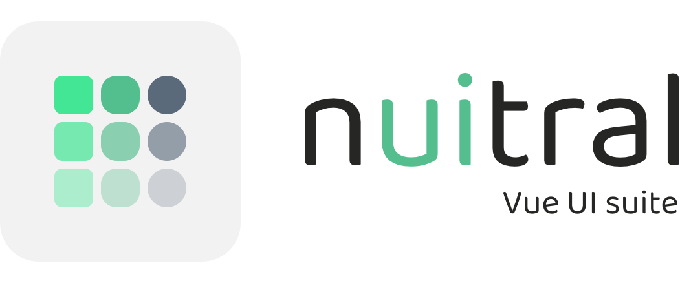

  <picture>
    <source media="(prefers-color-scheme: dark)" srcset="./media/vue-suite-dark.png" height="150" />
    <source media="(prefers-color-scheme: light)" srcset="./media/vue-suite-light.png"  height="150" />
    
  </picture>

<b>nuitral Vue UI suite</b> provides a complete and native UI component suite for Vue projects.

<b>Status:</b> This project is currently in <b>alpha version</b>.

---

### 🔗 Suite

This library is part of the **nuitral** suite, a native UI toolkit designed to build modern, flexible, and high-performance interfaces.

Explore the suite → https://nuitral.github.io

---

### License

This project is licensed under the [MIT License](https://github.com/nuitral/vue-ui-suite/blob/main/LICENSE).

Copyright (c) 2025 **Nicola Centonze**